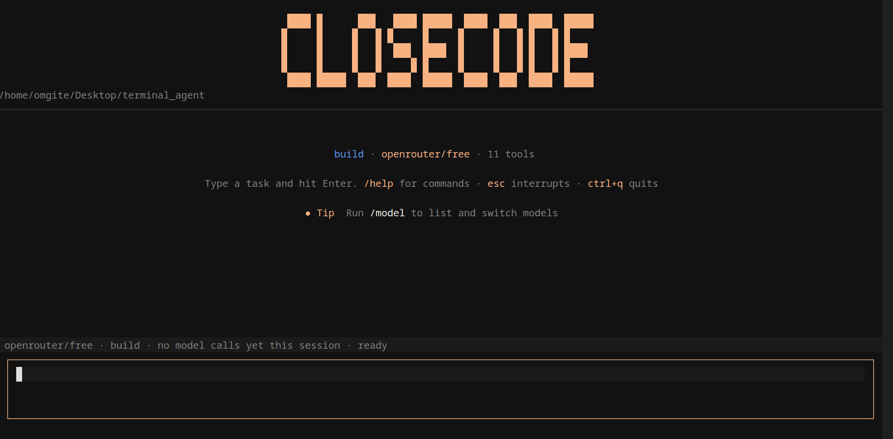

<div align="center">

# CloseCode

**An agentic terminal coding assistant — LangGraph loop, sandboxed execution, and a full-screen TUI.**

[](LICENSE)
[](https://www.python.org/downloads/)
<!-- Once CI exists, add: [](https://github.com/omgite333/CLOSECODE/actions) -->

<!-- SCREENSHOT: full-screen TUI on startup — banner, model name, workdir, tool list.
     Capture: run `closecode`, wait for the banner, screenshot the terminal.
     Save as: docs/banner.png -->


</div>

---

CloseCode reads a task, decides what to do, runs a tool, looks at the result, and repeats —
the same loop as OpenCode or Claude Code, built from scratch on LangGraph (agent loop),
LangChain (tool + model abstraction), and OpenRouter (model access). It runs entirely in
your terminal, in a full-screen TUI or a classic line-based mode, and every action it takes
on your files or shell goes through a sandboxed harness with permission prompts.


## Why

Most people can't `pip install openai` and get an agent — the hard part isn't calling a
model, it's the loop around it: binding the right tools per mode, confirming risky actions,
persisting sessions, and stopping the model from doing something destructive. CloseCode is
that scaffolding, built openly, with open models via OpenRouter instead of a closed API.

## Features

- **Full-screen TUI** (Textual) or a classic line-based REPL — same agent loop underneath,
  switchable with `--no-tui`
- **Sandboxed execution** — file and shell operations are confined to a working directory;
  path traversal (`../../etc/passwd`, absolute paths, Windows drive prefixes) is blocked
  at the harness level, not just by convention
- **Plan / Build modes** — Plan mode literally never binds write/edit/bash tools to the
  model, so it can explore and propose a plan with no possibility of a side effect
- **Guardrails** — four layers: input-scope filtering, destructive-command blocking
  (`rm -rf /`, fork bombs, `curl | sh`), malicious-write scanning, and output redaction
- **Persistent sessions** — SQLite-backed conversation history; `/resume`, `/sessions`,
  `--continue`
- **Todo tracking** — the agent maintains a visible task list for multi-step work
  (`todo_write` / `todo_read`)
- **Code-aware search** — dedicated `grep`/`glob` tools (not raw shell), sandboxed and
  available even in Plan mode since they're read-only
- **Git tools via MCP** — status, diff, log, commit, branches, through `mcp-server-git`
- **Any OpenRouter model** — free-tier models by default; switch with `/model`, browse
  with `/models`
- **Per-user config** — your API key and default model persist in `~/.closecode/config.json`
  (0600 permissions), independent of which directory you launch from

## Install

```bash
pipx install closecode-ai
closecode
```

<!-- Adjust this section once published — this is the target state, not necessarily
     live yet. Until it's on PyPI, use the git-based install below instead. -->

**From source, right now:**

```bash
git clone https://github.com/omgite333/CLOSECODE.git
cd CLOSECODE
pip install -e .
closecode
```

`pipx` is recommended over `pip` for the packaged version since it installs CLI tools into
an isolated environment and puts them straight on your `PATH`.

## Tests

```bash
pip install -e ".[dev]"
pytest
```

429 tests covering guardrails, sandbox path resolution, undo/checkpoints, background
processes, todo-store invariants, plan-mode tool filtering, session persistence, config
permissions, and the search tools. The suite is fully isolated: `config.py` and
`session.py` are redirected to temp dirs, no test touches the network, and nothing is
written to your real `~/.closecode`.

Some tests are marked `xfail` for **known bugs** rather than fixed behaviour — they
document a gap and will flip to passing when it's fixed. Run `pytest -rx` to list them.

## Quick start

1. Get a free API key at [openrouter.ai/settings/keys](https://openrouter.ai/settings/keys)
2. Run `closecode` — on first launch it prompts for the key (input hidden) and offers to
   save it to `~/.closecode/config.json` so you're not asked again
3. Type a task:

   ```
   > find every place we call the old auth API and list the files
   ```

<!-- SCREENSHOT: a permission prompt in action — "Allow agent to run: `grep -r ...`?"
     This is worth showing on its own since it's the project's core safety story.
     Save as: docs/permission-prompt.png -->


## How it works

```
 user input
     │
     ▼
 ┌──────────┐   binds tools for current mode     ┌───────────────┐
 │  agent   │ ───────────────────────────────▶ │ LangGraph loop│
 │ (llm.py) │                                   │  (agent.py)   │
 └──────────┘                                    └──────┬────────┘
                                                        │ tool call
                                                        ▼
                                              ┌───────────────────────┐
                                              │      Harness          │
                                              │ sandboxed fs + shell  │──▶ guardrails.py
                                              └───────────────────────┘     (blocks/scans)
                                                        │ result
                                                        ▼
                                              ┌──────────────────────┐
                                              │  Renderer interface  │
                                              │ (render.py)          │
                                              └──────┬──────────┬────┘
                                                     ▼          ▼
                                               tui.py + tui_*.py  ui.py + ui_*.py
                                               (Textual)          (classic)
```

A single `Renderer` interface (`render.py`) decouples the agent loop from presentation, so
the Textual TUI and the classic REPL are two implementations of the same contract rather
than two copies of the agent logic.

Each frontend is a small set of single-purpose modules behind a facade, so the entry module
stays readable and the parts can be reused or tested on their own:

| Frontend | Facade | Split into |
|---|---|---|
| Textual | `tui.py` — app, message handlers, input, suggestions | `tui_theme.py` (banner, palette, CSS) · `tui_messages.py` (Message classes, `TuiRenderer`) · `tui_widgets.py` (conversation blocks, input box, modals, `ConfirmBridge`) |
| Classic | `ui.py` — the `print_*` / `stream_*` renderers | `ui_theme.py` (shared `Console`, palette, banner) · `ui_prompts.py` (permission dialog, input, `EscListener`) |

Each facade re-exports the names its split modules define, so `from ui import ...` and
`from tui import ...` keep working exactly as before.


## Modes

| Mode | Command | Tools available | Use for |
|---|---|---|---|
| **Plan** | `/plan` | Read-only: `read_file`, `list_dir`, `grep`, `glob`, `tavily_search` | Exploring a codebase, proposing an approach with zero risk of a side effect |
| **Build** | `/build` | Everything, including `write_file`, `edit_file`, `bash`, `run_tests`, git tools | Actually making changes |

Plan mode isn't a prompt instruction the model can ignore — the write/edit/bash tools are
never bound to the model in the first place.

## Tools

| Tool | Description |
|---|---|
| `read_file` / `write_file` / `edit_file` | Read, overwrite, or targeted find-and-replace on a file |
| `list_dir` | List a directory's contents |
| `glob` / `grep` | Find files by pattern / search file contents by regex — sandboxed, available in Plan mode |
| `bash` | Run a shell command in the sandbox (capped timeout, guardrail-checked) |
| `run_tests` | Run the project's test command and report pass/fail |
| `todo_write` / `todo_read` | Maintain a visible multi-step task list |
| `tavily_search` | Web search for current docs/APIs (requires `TAVILY_API_KEY`) |
| git tools (`status`, `diff`, `log`, `commit`, branches) | Via `mcp-server-git`, enabled with `AGENT_ENABLE_GIT=true` |

## Commands

```
/plan, /build         switch modes
/models [filter]      list OpenRouter models (free-tier first)
/model <id|number>    switch model
/key                  update your OpenRouter API key
/sessions             list saved conversations
/resume <id>          switch to a saved session
/delete <id>          delete a saved session
/usage                token usage for this session
/clear                start a new session
/help                 show all commands
```

## Configuration

All settings are environment variables (`.env`, or exported in your shell) — see
`.env.example` for the full list. Key ones:

| Variable | Default | Purpose |
|---|---|---|
| `OPENROUTER_API_KEY` | — | Required (or saved via `/key` into `~/.closecode/config.json`) |
| `OPENROUTER_MODEL` | `nvidia/nemotron-3.5-lightning:free` | Default model |
| `AGENT_WORKDIR` | `./sandbox` | Directory the agent is confined to |
| `AGENT_AUTO_APPROVE` | `false` | Skip permission prompts (guardrails still apply) |
| `AGENT_ENABLE_GIT` | `false` | Load git tools via MCP |
| `AGENT_DISABLE_GUARDRAILS` | `false` | Disable guardrails — trusted/isolated testing only |
| `TAVILY_API_KEY` | — | Enables `tavily_search` |
| `LANGCHAIN_API_KEY` | — | Enables LangSmith tracing |

## Safety model

This is layered defense, not a single mechanism:

1. **Input scope** — off-topic requests are redirected; clearly malicious requests
   (keyloggers, phishing kits, account-hacking) are refused before reaching the model
2. **Command blocking** — destructive shell commands are blocked before execution, even
   with auto-approve on
3. **Write scanning** — file writes/edits are scanned for malware indicators before
   they're applied
4. **Output redaction** — flagged content is scrubbed from conversation history
5. **Sandboxed paths** — every file operation resolves through the harness, which refuses
   to write outside the configured working directory regardless of how the path is phrased

These are conservative heuristics layered on top of the sandbox and per-action permission
prompts — not a formal guarantee. Shell commands currently run on the host inside a
path-restricted directory, not inside a container; see [Roadmap](#roadmap).

## A note on model choice

Tool-calling reliability varies a lot across open models — this is the single biggest
factor in how well the agent performs. Frontier closed models are heavily trained for
reliable tool use; open models are improving but inconsistent. Roughly in order of
reliability, worth trying via `/model`:

- `qwen/qwen-2.5-coder-32b-instruct` — code-specialized, solid tool use, free tier available
- `qwen/qwen-2.5-72b-instruct` — strong, reliable, paid
- `meta-llama/llama-3.1-70b-instruct` — strong, reliable, paid
- `meta-llama/llama-3.1-8b-instruct` — fastest/cheapest, least reliable

If a smaller model frequently fails to call tools or hallucinates arguments, that's a
known gap between open and closed models on agentic tasks, not a bug here. Switching
models is the first thing to try before changing anything else.

## Roadmap

- [x] Test suite (`pytest tests/`) — guardrails, sandbox path resolution, todo-store invariants
- [ ] CI (run the suite on push)
- [ ] Docker-based sandbox for shell execution, not just path restriction
- [ ] Client/server split — `build_graph()` behind FastAPI/WebSocket, thin streaming client
- [ ] PyPI release + prebuilt binaries (PyInstaller) for no-Python-required installs
- [ ] Homebrew tap

## Contributing

Issues and PRs welcome. If you're adding a tool, follow the pattern in `tools.py` /
`search.py`: bind state via a module-level `bind_*()` function, keep it sandboxed to the
harness root, and add it to the Plan-mode allowlist only if it's genuinely read-only.

## License

MIT — see [LICENSE](LICENSE).
